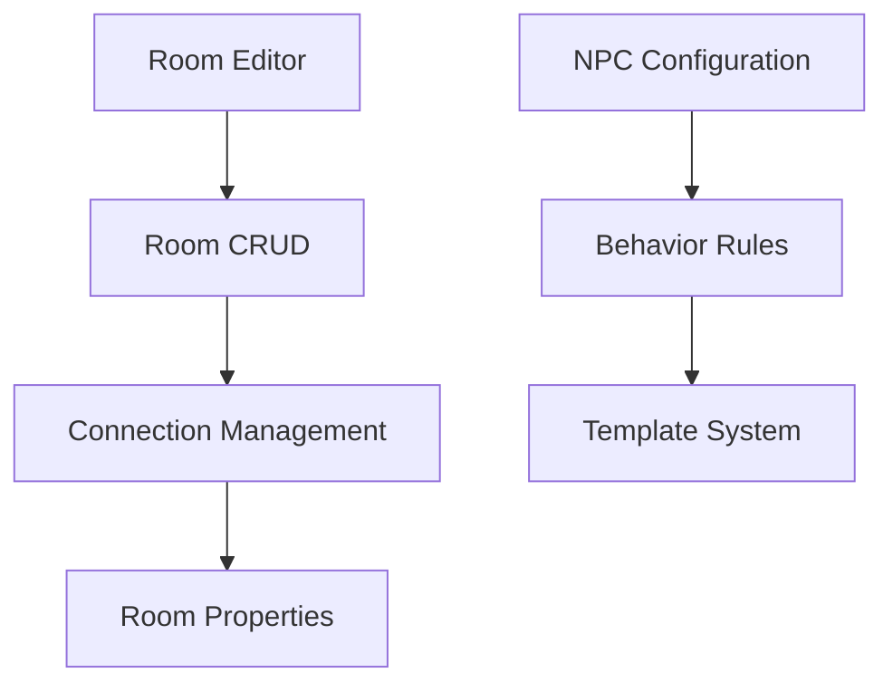

# ExVenture Active Context

## Current Focus Areas

### Game Client
- React-based web interface implementation
- Real-time communication system
- Command parsing and execution
- User interface components:
  - Chat system
  - Inventory management
  - Room visualization
  - Character status

### Admin Dashboard (Current Focus)
- LiveView-based admin interface with custom components
- World management tools:
  - Zone management (Completed)
  - Room editor (Next Focus)
  - NPC management
  - Item creation
- Completed:
  - Admin authentication system with Argon2 password hashing
  - Admin database schema and migrations
  - LiveView-based login interface
  - Protected admin routes
  - Session management
  - Default admin account
  - Full Zone CRUD with staged changes
  - Zone publishing workflow
  - Real-time updates via PubSub
  - Sortable and filterable zone list
  - Form validation with error handling
  - Confirmation modals for destructive actions
- Next Focus:
  - Room management interface
  - NPC configuration tools
  - Item management system

### Core Engine (Kantele)
- Event-driven game mechanics
- Character state management
- World state persistence
- NPC behavior systems

## Recent Changes

### Architecture
- Completed Zone management implementation
- Added staged changes visualization
- Implemented publish/unpublished state management
- Added confirmation workflows for destructive actions
- Enhanced real-time updates with PubSub
- Improved form validation and error handling

### Features
- Full Zone CRUD operations
- Zone publish workflow
- Staged changes tracking
- Real-time zone updates
- Sort and filter capabilities
- Confirmation modals
- Enhanced error handling

## Active Decisions

### Technical Choices
1. LiveView for Admin Interface
   - Real-time updates via PubSub
   - Server-side state management
   - Custom component patterns
   - Modal-based workflows
   - Staged changes tracking

2. Zone Management Architecture
   - Published/unpublished state control
   - Staged changes for published zones
   - Confirmation workflows
   - Real-time updates
   - Proper error handling

### Implementation Patterns
1. LiveView Components
   ```elixir
   # Pattern for modal management
   def handle_event("close_modal", %{"modal" => modal}, socket) do
     {:noreply,
      socket
      |> assign(:"show_#{modal}_modal", false)
      |> assign(:selected_zone, nil)
      |> assign(:changeset, Zones.new_changeset())
      |> assign(:action, nil)
      |> assign(:staged_changes, [])}
   end
   ```

2. Confirmation Workflow
   ```elixir
   def handle_event("confirm_publish", %{"id" => id}, socket) do
     {:noreply,
      socket
      |> assign(:selected_zone, %{id: id})
      |> assign(:show_publish_modal, true)}
   end
   ```

## Project Insights

### Learned Patterns
1. Modal Management
   - Separate modals for different actions
   - Proper state cleanup on close
   - Confirmation workflows
   - Form validation display

2. LiveView State
   - PubSub for real-time updates
   - Staged changes tracking
   - Sort/filter state management
   - Error state handling

### Current Focus
1. Room Management
   - CRUD interface design
   - Room visualization
   - Connection management
   - Room properties

2. NPC System
   - Behavior configuration
   - Spawn management
   - Interaction rules

## Next Steps

### Immediate Tasks
1. [x] Configure initial router setup
2. [x] Create Zone schema and migration
3. [x] Complete admin authentication system
4. [x] Create Zone LiveView components
5. [x] Implement Zone CRUD
6. [x] Add staged changes
7. [x] Add publish workflow
8. [ ] Design room management interface
9. [ ] Implement room CRUD operations

### Upcoming Features
1. Room Management
   - Room editor interface
   - Connection visualization
   - Property management
   - Room templates

2. NPC Configuration
   - Behavior editor
   - Spawn rules
   - Interaction management
   - Template system

## Critical Paths

### Current Implementation Focus


This document is updated as the project evolves and new patterns emerge.
