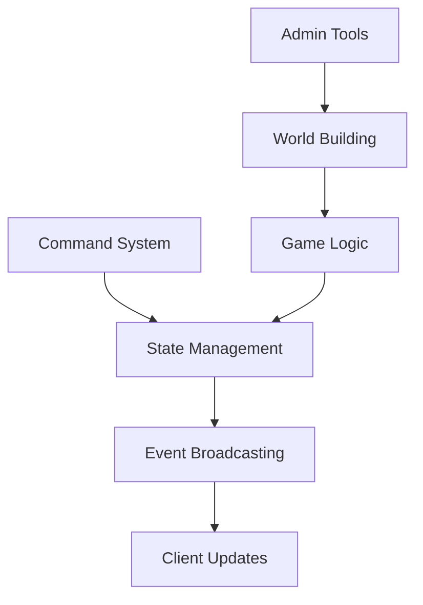

# ExVenture Active Context

## Current Focus Areas

### Game Client
- React-based web interface implementation
- Real-time communication system
- Command parsing and execution
- User interface components:
  - Chat system
  - Inventory management
  - Room visualization
  - Character status

### Admin Dashboard
- LiveView-based admin interface
- World management tools:
  - Room editor
  - NPC management
  - Item creation
  - Zone configuration

### Core Engine (Kantele)
- Event-driven game mechanics
- Character state management
- World state persistence
- NPC behavior systems

## Recent Changes

### Architecture
- Implemented Phoenix LiveView for admin interfaces
- Set up React/Redux for game client
- Established WebSocket communication patterns
- Configured deployment pipelines

### Features
- Character creation system
- Basic movement commands
- Chat functionality
- Room management
- User authentication
- Admin dashboard views

## Active Decisions

### Technical Choices
1. Using LiveView for admin interfaces
   - Provides real-time updates
   - Reduces JavaScript complexity
   - Maintains server-side state

2. React for game client
   - Complex UI requirements
   - State management needs
   - Custom rendering logic

3. Data storage patterns
   - PostgreSQL for persistent data
   - ETS for caching
   - Phoenix PubSub for real-time updates

### Implementation Patterns
1. Command Processing
   ```elixir
   # Pattern for handling game commands
   def handle_command(command, character) do
     # Command validation
     # State updates
     # Broadcast changes
   end
   ```

2. State Management
   ```elixir
   # Pattern for managing game state
   def update_state(state, event) do
     # Validate changes
     # Apply updates
     # Notify subscribers
   end
   ```

## Project Insights

### Learned Patterns
1. Event Broadcasting
   - Use specific topics for different event types
   - Include necessary context in payloads
   - Handle failure cases gracefully

2. State Synchronization
   - Keep client/server state in sync
   - Handle network latency
   - Resolve conflicts

3. Performance Optimization
   - Cache frequently accessed data
   - Batch database operations
   - Optimize WebSocket communication

### Current Challenges
1. Real-time Performance
   - Large number of concurrent connections
   - State synchronization across nodes
   - Message broadcasting efficiency

2. Game Logic
   - Complex interaction rules
   - NPC behavior systems
   - Combat mechanics

3. User Experience
   - Command discoverability
   - Feedback clarity
   - UI responsiveness

## Next Steps

### Immediate Tasks
1. [ ] Enhance command system
2. [ ] Improve NPC behaviors
3. [ ] Expand admin tools
4. [ ] Add more game mechanics

### Upcoming Features
1. Combat System
   - Turn-based mechanics
   - Damage calculation
   - Status effects

2. Social Features
   - Group system
   - Trading
   - Chat channels

3. World Building
   - Quest system
   - Dynamic events
   - Weather effects

## Critical Paths

### Current Implementation Focus


This document is updated as the project evolves and new patterns emerge.
