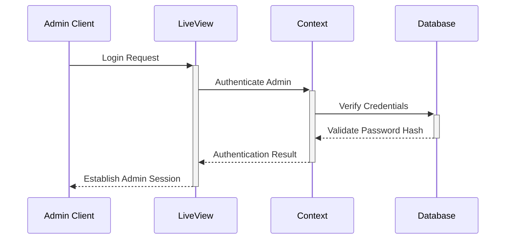
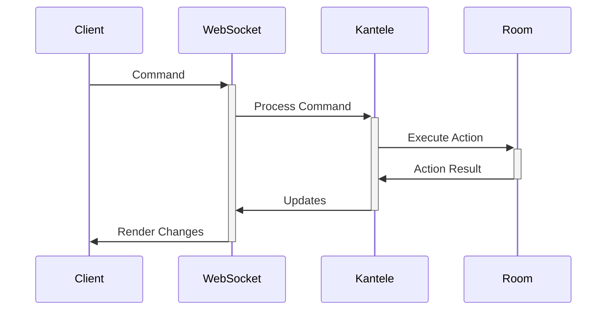

# ExVenture System Patterns

## Project Design Philosophy

ExVenture is a modern, modular MUD framework built with Elixir, Phoenix, and a forked Kalevala engine. It prioritizes real-time, persistent multiplayer systems, scalable behavior-driven AI, and a LiveView-based admin interface for dynamic worldbuilding. The architecture supports Cline Memory Bank workflows, emphasizes separation of concerns, and is designed to be extensible with minimal coupling between client, admin, and game logic. Its architecture balances:

- A persistent Elixir backend (Phoenix + Kantele fork)
- A graphical frontend powered by React + LiveView (admin)
- Strict separation between gameplay logic (Kantele) and presentation (Phoenix/Web)
- Cline Memory Bank-driven documentation for consistent context

Code changes should reinforce:
- Maintainability via clearly separated contexts
- Real-time interaction using WebSockets and LiveView
- Dynamic admin control via Petal + Tailwind
- Modularity in both frontend and backend components


## Architecture Overview

```mermaid
graph TD
    ReactClient[React Game Client] --> Phoenix[Phoenix Endpoint]
    AdminUI[LiveView Admin w/ Petal --> Phoenix
    Phoenix --> Router[Router]
    Router --> WS[WebSocket Channels]
    Router --> LiveView[LiveView Controllers]
    Router --> Controllers[Traditional Controllers]
    
    WS --> GameEngine[Kantele Game Engine]
    LiveView --> Web[Web Layer]
    Controllers --> Web
    Web --> Repo[Ecto Repo]
    GameEngine --> Repo
    Repo --> DB[(PostgreSQL)]
```

## Core Components

### Web Layer
1. **Phoenix Framework**
   - Handles HTTP and WebSocket connections
   - Serves static assets
   - Manages sessions and authentication
   - Admin authentication with Argon2 password hashing
   - LiveView for real-time admin interfaces

2. **LiveView Architecture**
   - Used for admin interfaces
   - Real-time updates without JavaScript
   - Pattern: HEEX templates with live components

3. **React Client**
   - Game interface implementation
   - State management with Redux
   - WebSocket communication
   - Custom text parsing and rendering

### Game Engine (Kantele)
1. **Core Systems**
   - Event-driven architecture
   - Actor model for character/NPC management
   - Message passing for communication

2. **World Management**
   - Room graph structure
   - Zone-based organization
   - Dynamic content loading

3. **State Management**
   - GenServer-based state
   - ETS tables for caching
   - PostgreSQL for persistence

## Design Patterns

### Communication Patterns
1. **Command Pattern**
   - Used for player inputs
   - Consistent interface for all commands
   - Easy extension for new commands

2. **Observer Pattern**
   - Room events
   - Character state changes
   - System notifications

3. **Pub/Sub Pattern**
   - Game events
   - Chat systems
   - World updates

### Domain Patterns
1. **Context Organization**
   ```
   lib/
   ex_venture/     # Core business logic
   kantele/        # Game engine (forked and extended)
      ├── brain/    # Behavior trees
      ├── zone/     # Zone and room logic
   web/            # Web interfaces (Phoenix + LiveView)
      ├── live/         # Admin LiveViews
      ├── components/   # Petal HEEX components
      ├── controllers/  # Traditional routes
      └── templates/
   ```

2. **Entity Management**
   - Characters (players, NPCs)
   - Rooms and zones
   - Items and equipment
   - Containers and inventories

3. **State Management**
   - Immutable state updates
   - Event sourcing for game actions/logging
   - Optimistic updates in client and admin UIs

## Key Implementation Paths

### Authentication Flow


### Game Action Flow


## Critical Patterns

1. **Error Handling**
   - Graceful degradation
   - User-friendly error messages
   - Structured error tuples ({:ok, result} / {:error, reason})
   - Automatic recovery where possible
   - Flash and live feedback in web and admin UIs

2. **Performance Optimization**
   - Connection pooling and supervision trees
   - Caching with ETS for hot data
   - Efficient batch DB queries and indexing

3. **Security Measures**
   - Input validation and sanitization
   - Rate limiting
   - Admin authentication with Argon2 password hashing
   - Role-based access controls via ensure_admin plug
   - Protected admin routes with session checks
   - CSRF protection and token management 
   - LiveView route guards with real-time session validation


4. **Testing Strategy**
   - Unit tests for modules and nodes
   - Integration tests for commands and state
   - End-to-end for critical paths
   - Wallaby or Playwright for LiveView interfaces
   - Behavior tree test harnesses with mock nodes
   - Seeded dev data for repeatable test states

! Do not bypass Kantele for gameplay logic. All in-world interactions (movement, combat, communication, etc.) must be processed by the game engine to preserve consistency and modularity.

This document serves as a reference for maintaining consistency in system design and implementation.
