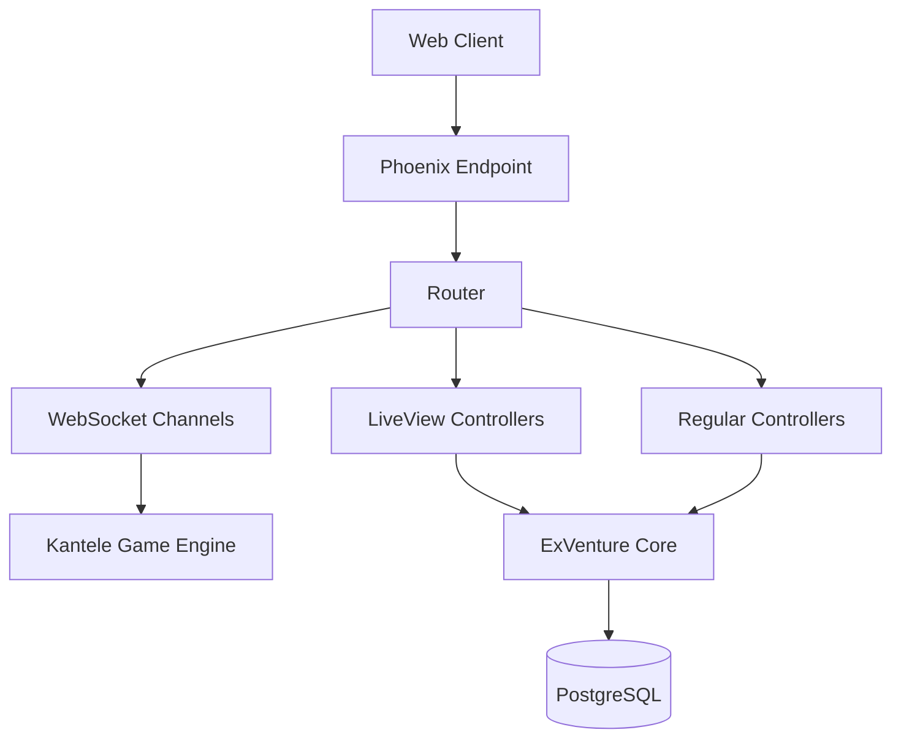
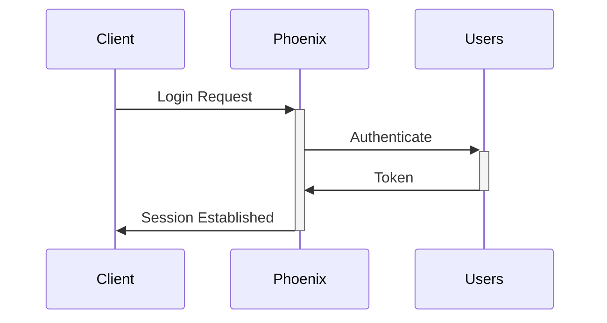
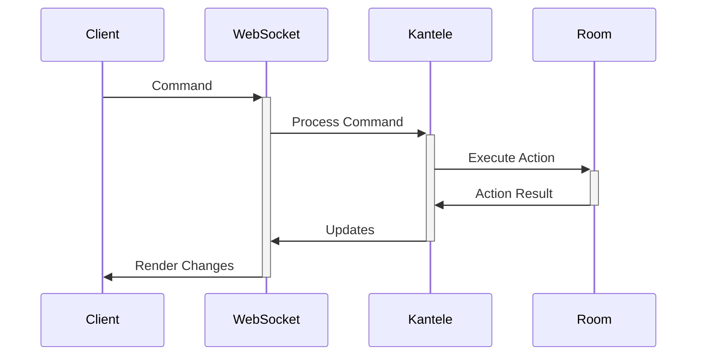

# ExVenture System Patterns

## Architecture Overview



## Core Components

### Web Layer
1. **Phoenix Framework**
   - Handles HTTP and WebSocket connections
   - Serves static assets
   - Manages sessions and authentication

2. **LiveView Architecture**
   - Used for admin interfaces
   - Real-time updates without JavaScript
   - Pattern: HEEX templates with live components

3. **React Client**
   - Game interface implementation
   - State management with Redux
   - WebSocket communication
   - Custom text parsing and rendering

### Game Engine (Kantele)
1. **Core Systems**
   - Event-driven architecture
   - Actor model for character/NPC management
   - Message passing for communication

2. **World Management**
   - Room graph structure
   - Zone-based organization
   - Dynamic content loading

3. **State Management**
   - GenServer-based state
   - ETS tables for caching
   - PostgreSQL for persistence

## Design Patterns

### Communication Patterns
1. **Command Pattern**
   - Used for player inputs
   - Consistent interface for all commands
   - Easy extension for new commands

2. **Observer Pattern**
   - Room events
   - Character state changes
   - System notifications

3. **Pub/Sub Pattern**
   - Game events
   - Chat systems
   - World updates

### Domain Patterns
1. **Context Organization**
   ```
   lib/
     ex_venture/    # Core business logic
     kantele/       # Game engine
     web/          # Web interfaces
   ```

2. **Entity Management**
   - Characters
   - Rooms
   - Items
   - NPCs

3. **State Management**
   - Immutable state updates
   - Event sourcing for game actions
   - Optimistic UI updates

## Key Implementation Paths

### Authentication Flow


### Game Action Flow


## Critical Patterns

1. **Error Handling**
   - Graceful degradation
   - User-friendly error messages
   - Automatic recovery where possible

2. **Performance Optimization**
   - Connection pooling
   - Caching strategies
   - Batch operations

3. **Security Measures**
   - Input sanitization
   - Rate limiting
   - Authentication checks
   - CSRF protection

4. **Testing Strategy**
   - Unit tests for core logic
   - Integration tests for flows
   - End-to-end for critical paths

This document serves as a reference for maintaining consistency in system design and implementation.
